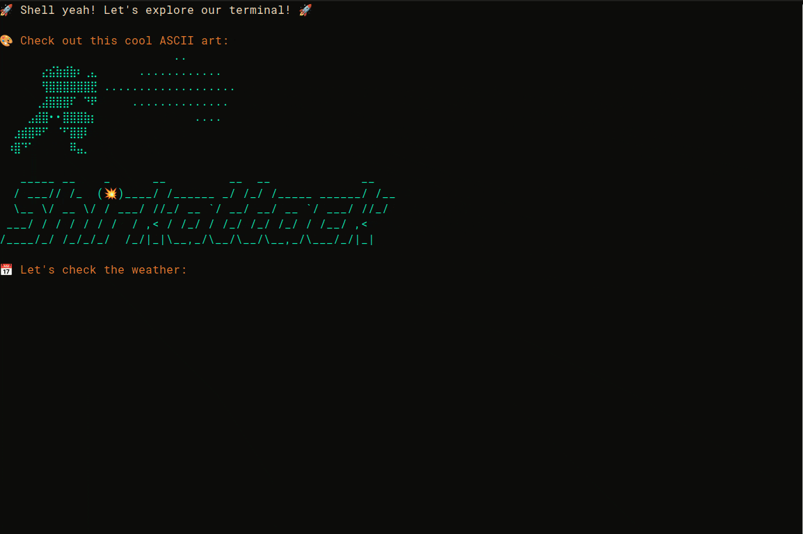

# 🛹 Shell Yeah! – Pimp Your Terminal Like a Pro

> Because life's too short for a boring terminal. Also, cool people don’t type out long Docker commands. 🤙

## 🌮 Why Trick Out Your Terminal?

Let’s be real—if you’re spending half your life staring at a black rectangle full of cryptic text, **it better look good and work even better**. Your terminal should spark **joy, not dread**. And no, adding another Jupyter notebook isn’t the answer. 🙃

I used to type out **`docker-compose up --build --force-recreate --remove-orphans`** like a chump. Now? Just `dcup`. Life’s too short for repetitive stress injuries. 🕺🏽

Also, this project is all about **inspiration and fun**, not a one-size-fits-all solution. Your terminal should match your vibe!

## 🎬 Behold! A terminal so slick, even Hollywood hackers would be jelly 🪼 




- 🎨 **Powerlevel10k theme** – because looking good is half the battle
- 📊 **Smart data previews** – who needs `pandas .info()` when you have *this*?
- 🌡️ **Weather updates** – because "it works on my machine" depends on the weather sometimes
- 🔍 **File navigation that doesn’t suck** (powered by `lsd`)
- 🐳 **Docker shortcuts** – because nobody has time to type `docker ps -a`
- 🐙 **Git commands that don’t make you rage-quit**
- 🚦 **System monitoring that actually makes sense** (coming soon)
- 💻 **Network tools for when your VPN is up to no good** (coming soon)

## 🖥️ Platform Support

✅ **Linux** (Ubuntu, Debian, Fedora, Arch, etc.)
✅ **macOS** (Intel & Apple Silicon)

All commands automatically adapt to your platform—no manual configuration needed!

## 🛠️ The Magic Under the Hood

### 1. Data Previews That Feel Like Cheating 🏄‍♂️
```bash
preview data.csv  # Works on .json too!
```
No more `head data.csv | less`. This command gives you:
- File details (size, rows, columns)
- Column types + missing value analysis
- Sample values from each column
- A sleek preview of the first five rows
- **Security built-in**: File size limits (100MB max) and path validation to keep things safe

### 2. System Commands That Just Work 🦥
```bash
myip        # What's my IP again? Oh yeah…
weather     # Look outside? Nah, I'll ask my terminal.
mem         # How much RAM do I have left? (works on both Linux & macOS)
ports       # See what's listening (platform-aware)
big         # What's eating up my disk space?
```
**Platform-smart**: Commands automatically adapt to Linux or macOS—no config needed!

### 3. Dev Shortcuts That Respect Your Time ⏳
```bash
# Git workflow without the existential crisis
gs          # git status
ga          # git add
gc          # git commit
gp          # git push

d           # docker
dc          # docker-compose
dps         # docker ps
di          # docker images
```

## 🧬 Make It *Yours* – Because Defaults Are Boring

### 1. Colors & Theme 🎭
Tweak `p10k.zsh` to:
- Change colors
- Adjust icons and symbols
- Modify segment display
- Give your prompt a personal touch

### 2. Add Your Own Aliases 🍕
```bash
# Speedrun Jupyter Lab
alias jl='jupyter lab --no-browser'

# Virtual environments made easy
alias venv='python -m venv venv && source venv/bin/activate'
```

### 3. Custom Functions for the Dark Arts 🦹
```bash
Drop your scripts into `scripts/` to:
- Automate data processing
- Create your own GPU monitoring tools
- Add project-specific shortcuts

## ⚗️ Installation – Let's Get This Party Started 🕺🏽

**Good news!** The setup auto-detects where you clone the repo—no hardcoded paths to fix. Clone it anywhere you like!

### 🐧 Linux Setup
```bash
# 1. Clone the repo (anywhere you want!)
git clone https://github.com/yourusername/shell_yeah.git ~/my-custom-location
cd ~/my-custom-location

# 2. Install dependencies
sudo apt-get update && sudo apt-get install zsh curl git python3-pip

# 3. Install Oh My Zsh
sh -c "$(curl -fsSL https://raw.github.com/ohmyzsh/ohmyzsh/master/tools/install.sh)"

# 4. Install Powerlevel10k
git clone --depth=1 https://github.com/romkatv/powerlevel10k.git ${ZSH_CUSTOM:-$HOME/.oh-my-zsh/custom}/themes/powerlevel10k

# 5. Install Python goodies
pip install -r scripts/requirements.txt

# 6. Copy the configuration files
cp sample_zsh.zsh ~/.zshrc

# 7. Install zsh plugins (required for the config)
git clone https://github.com/zsh-users/zsh-autosuggestions ${ZSH_CUSTOM:-~/.oh-my-zsh/custom}/plugins/zsh-autosuggestions
git clone https://github.com/zsh-users/zsh-syntax-highlighting.git ${ZSH_CUSTOM:-~/.oh-my-zsh/custom}/plugins/zsh-syntax-highlighting
git clone https://github.com/zsh-users/zsh-history-substring-search ${ZSH_CUSTOM:-~/.oh-my-zsh/custom}/plugins/zsh-history-substring-search

# 8. Make scripts executable
chmod +x scripts/*.py demo-script.sh

# 9. Restart terminal and configure Powerlevel10k
exec zsh
# When prompted, run through the p10k configuration wizard:
p10k configure
```

### 🍏 MacOS Setup
```bash
# 1. Install Homebrew
/bin/bash -c "$(curl -fsSL https://raw.githubusercontent.com/Homebrew/install/HEAD/install.sh)"

# 2. Install dependencies
brew install zsh curl git python3

# 3. Follow the Linux steps from #3 onwards
```

## 🔧 Troubleshooting

### Theme Not Loading
If Powerlevel10k doesn't appear after installation:
```bash
# Run the configuration wizard
p10k configure

# Or check if the theme is properly installed
ls ${ZSH_CUSTOM:-$HOME/.oh-my-zsh/custom}/themes/powerlevel10k
```

### Plugins Not Working
If you get "plugin not found" errors:
```bash
# Make sure all plugins are installed
# For zsh-autosuggestions:
git clone https://github.com/zsh-users/zsh-autosuggestions ${ZSH_CUSTOM:-~/.oh-my-zsh/custom}/plugins/zsh-autosuggestions

# For zsh-syntax-highlighting:
git clone https://github.com/zsh-users/zsh-syntax-highlighting.git ${ZSH_CUSTOM:-~/.oh-my-zsh/custom}/plugins/zsh-syntax-highlighting

# For zsh-history-substring-search:
git clone https://github.com/zsh-users/zsh-history-substring-search ${ZSH_CUSTOM:-~/.oh-my-zsh/custom}/plugins/zsh-history-substring-search
```

### Preview Command Not Working
If the `preview` command fails:
```bash
# Ensure Python dependencies are installed
pip install -r scripts/requirements.txt

# Make sure Python 3.8+ is installed
python3 --version

# The path is auto-detected, but verify the script exists
ls scripts/data_preview.py
```

**Note**: The preview command has a 100MB file size limit for security. If you need to preview larger files, you can adjust `MAX_FILE_SIZE` in `scripts/data_preview.py`.

### Commands Like `lsd` Not Found
Install missing system dependencies:
```bash
# Linux (Ubuntu/Debian)
sudo apt-get install lsd curl git

# macOS
brew install lsd curl git
```

## 📚 Want to Go Even Deeper? Nerd Out Here 🤓

- Big shoutout to [daniruiz](https://drasite.com/blog/Pimp%20my%20terminal) for the inspiration—check out his amazing work!
- [Oh My Zsh](https://github.com/ohmyzsh/ohmyzsh/wiki) – Make your terminal look spicy
- [Powerlevel10k](https://github.com/romkatv/powerlevel10k) – The bling you deserve
- [Modern Unix Tools](https://github.com/ibraheemdev/modern-unix) – Because old Unix commands are *mid*
- [lsd](https://github.com/lsd-rs/lsd) - Not the hallucinogen, but a better `ls`
- [Simple Icons](https://simpleicons.org/) - For complicated people who like simple things
- [Terminal Sexy](https://terminal.sexy/) - It's like sunglasses for your shell 

## 🎈 Contribute & Make It Even Cooler
Got a killer alias, shortcut, or function? PRs are always welcome—for funsies!

## 📜 License
MIT License – Do what you want, just don’t blame me if your terminal becomes too powerful. 🧙‍♂️

---

Your terminal should be as legendary as your coding skills. So go ahead, **pimp that shell**! 🍉🔥

